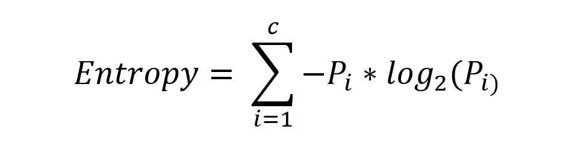
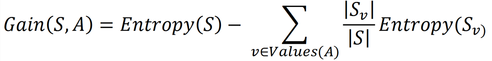
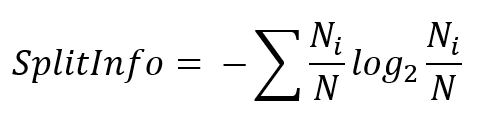
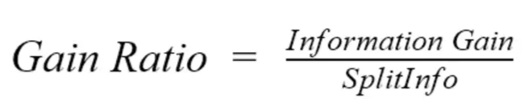
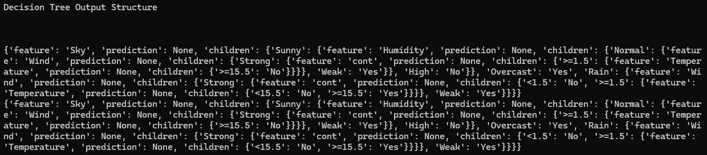
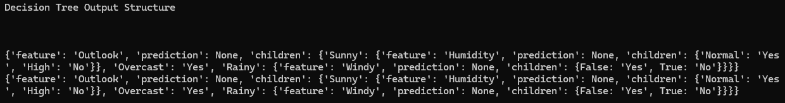

Here’s your improved documentation with corrected spelling, enhanced formatting, and **no changes to the content**. I made it cleaner and more professional for readers while keeping the original message intact:

---

# Decision Tree Algorithms Implementation

## Introduction

This project is a part of a larger project that I am working on currently, but I thought it would be nice to document the journey part by part.  
The main goal of this work was training, sharpening my programming skills, and starting to improve my relationship with the Machine Learning and Data Engineering fields since I have interest in them.  
I tried to take an old-school development approach by mainly relying on my knowledge, problem-solving intuition, and the resources accessible using Google. Meanwhile, I tried to keep the usage of LLMs as minimal as possible by only using them for error debugging and asking for architecture design suggestions.

---

## What Makes My Project Special?

1. **Far from perfect**: My project is not perfect, and I tried to implement all the logic depending on my conceptual understanding.  
2. **Ease of use**: As a user, you do not need to set any configurations—just run the program and everything will be handled behind the scenes.  
3. **Useful reference**: My project is modular, and many of its functions are pure functions, so they can be reused anywhere without problems.  
   For example, if you want to calculate the entropy of a column, just copy the function, paste it, enter the inputs, run the code—and here you go.

---

## Technical Features

1. **Dynamic Algorithm Selection**  
   No need to specify the type of algorithm. The program reads your data, analyzes it, and decides which algorithm to use dynamically.

2. **Wide Set of Utilities**  
   Besides implementing common utilities such as entropy, information gain, gain ratio, and split information methods, I designed a new method to handle continuous columns by calculating continuity probability, analyzing it, creating thresholds, evaluating all the available intervals, and selecting the best categorized continuous column candidate.

3. **Minimal Code**  
   I tried to make the codebase as minimal as possible by writing only the necessary logic.

4. **Multiple Advanced Topics**  
   Several advanced topics were used efficiently to accomplish proper outputs.

---

## Common Functions

**Entropy**  
A crucial base criterion for all operations in Decision Tree algorithms.  


**Information Gain**  
This function calculates how useful a column is in reaching a decision as soon as possible.



**Split Information**  
This refers to how the values inside a column are distributed, but in a mathematical way.


**Gain Ratio**  
An upgraded version of Information Gain, used in the C4.5 algorithm.



**Process Table**  
This function is used for both ID3 and C4.5 algorithms. It:
- Sets the target value by assuming it is the last column.
- Calculates the entropy of the target column and uses it to process the columns one by one.
- Contains the required conditions for terminating the Decision Tree classification process.
- Logs important information to keep track of how operations are going.
- Returns an object with the properties `is_leaf` and `value`.

---

## Data Processing Utilities

**exclude_root_feature(dataset, best_feature)**  
This function returns the labels of the input dataset after excluding the target column's label.  
Parameters:
- `dataset`: the currently processed dataset, which changes at each tree level.
- `best_feature`: the feature that will be used in the current level.

**detect_feature_data_types(column)**  
Counts the number of value types inside a single column and returns two variables: `proportions` and `classes_split`.  
- `proportion`: frequency of a value type over the length of the input column.  
- `classes_split`: the frequencies of each value type.  
This utility makes calculations easier.

**equivalent_target_values(feature_classes, feature_column, target_column)**  
Keeps track of the row positions between the original dataset and the sub-datasets generated when the tree splits.  

---

## C4.5 Algorithm Utilities

These functions define a pipeline for processing tables with continuous columns. The output is a processed table ready for classification.

**is_convertible_to_numeric(value)**  
Checks if a value is convertible to a numeric value or not (e.g., "1", "3.55").

**is_continuous(table)**  
Returns `True` if the input dataset contains any continuous columns; otherwise, returns `False`.

**check_continuous_columns(table, continuity_threshold=15)**  
Measures the continuity likelihood of each column:
1. Set threshold `T = 15` (default)
2. Count rows `N`
3. Calculate value frequency `F`
4. Compute `N/F = L`
5. If `L <= T`, apply `is_convertible_to_numeric` and return continuous columns.

**continuous_column_thresholds(data)**  
For each continuous column, creates thresholds to evaluate the best categorization split.  
Thresholds are calculated by averaging the values where target classes change.  

**categorize_value(x, T)**  
Each value in the continuous column is converted to either `< selected_threshold` or `>= selected_threshold`.  

**split_columns_using_thresholds(thresholds, data)**  
Splits a column based on the calculated thresholds and returns all the splits as candidates for the next processing step.

**categorize_continuous_column(column_target_dataset)**  
Evaluates each split using Gain Ratio, and converts the best one into categorical format.

**extract_continuous_columns(data)**  
Creates sub-datasets for each continuous column along with the target column for easier processing.

**handle_continuous_table(data)**  
This function wraps everything up. The processing pipeline starts here.

**merge_categorized_columns(columns, data)**  
Converts the processed table with continuous columns into a format usable by the `build_tree` function.

---

## Build the Tree

Both decision tree algorithms were implemented in **Functional** and **Object-Oriented Programming** styles, with similar naming conventions and logic flow.

---

### Functional Style

**build_tree(data_set, latest_tree_state)**  
The main function that uses most of the above utilities. It is invoked recursively while there is unprocessed data and returns the final Tree Decisions Object.  
It performs the following:
- Selects the appropriate algorithm (ID3 or C4.5)
- Sets configurations
- Processes input data
- Returns the result

---

### OOP Style

**class DecisionTree**

- **Properties**:
  1. `dataset`
  2. `target_index`

- **Behavior**:
  1. `__init__()` constructor
  2. `build_tree(self)` method

The `build_tree(self)` method is very similar to the functional `build_tree(data_set, latest_tree_state)`.

---

## Client

Running this algorithm is straightforward and requires no configuration from the user except entering the dataset.

### Option 1
```python
data = pd.read_csv("example_data.csv")
decision_tree = build_tree(data, {})
```

### Option 2
```python
data = pd.read_csv("example_data.csv")
tree = DecisionTree(data)
result_node = tree.build_tree()
```

---
## Output Examples:



