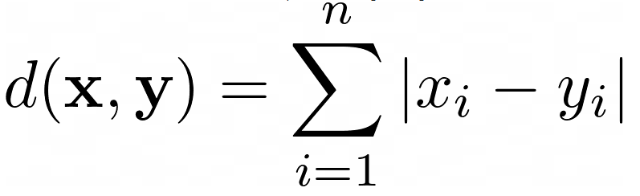
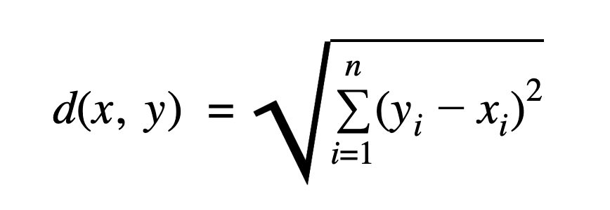
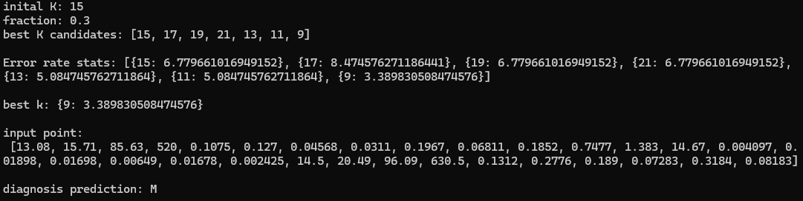

# Introduction

In this project, I implemented the **K-Nearest Neighbors (KNN)** algorithm from scratch using Python.  
The goal is to strengthen my understanding of data science and its relation to machine learning and software engineering through hands-on implementation.

During development, I intentionally avoided referring to existing KNN implementations in order to rely on my own problem-solving intuition. This helped me better recognize best practices when I encounter them later.  
This project is part of a larger production-level project and will be refined and optimized soon.

---

# KNN Utilities

### `areSimilar(point1, point2)`
A simple function to check whether the input and dataset points are similar (i.e., have the same dimensionality).

### `manhattan(vector1, vector2)`
Calculates the Manhattan distance between two vectors.  
**Note:** "Vector" refers to the numerical values of a point (excluding the target value).  



### `euclidean(vector1, vector2)`
Calculates the Euclidean distance between two vectors.  



### `calculate_distance(point1, point2, method="euclidean")`
This function computes the distance between two points using the chosen method.  
Defaults to Euclidean. It also checks if the two points are dimensionally identical.

### `initial_k(length)`
Returns the square root of the dataset length as an initial `k` value, rounded to the nearest odd integer.

---

# Data Processing Utilities

### `process_data(path)`
A pipeline that:
- Detects unsupported formats
- Scales values
- Handles missing or improper entries

### `extract_points(table, target_index = -1)`
Converts dataset rows into `Point` objects, making them suitable for processing.

### `is_convertible_to_numeric(value)`
Checks whether a value can be converted to a numeric format (`int` or `float`).

### `classes_frequencies(neighbors_labels)`
Counts the frequency of class labels among the K nearest neighbors.

---

# Functional Implementation

### `compute_distances(input, dataset, target_index = -1, method="euclidean")`
Calculates the distance between the input point and every point in the dataset.

### `classification(distances, K)`
Performs classification based on the majority class among the K nearest neighbors.

### `regression(distances, K)`
Performs regression by averaging the target values of the K nearest neighbors.

### `predict(input, dataset, K, target_index = -1, method="euclidean")`
Predicts the target value of the input point using either classification or regression, depending on the dataset type.

### `evaluate(dataset, test_fraction=0.3)`
Splits the dataset into train and test subsets. Each test point is evaluated using the train set.  
Generates a few candidate K values and returns the one with the lowest error rate.

---

# OOP Implementation

The object-oriented version implements the same functionality as the functional version, but in a class-based style with its own syntax.

---

# Demo

```python
from utils.datalab import *
from models.Point import *
from models.Knn import *
from functional_implementation.build_knn import *

test_point = Point(
    13.08, 15.71, 85.63, 520, 0.1075, 0.127, 0.04568, 0.0311, 0.1967, 0.06811,
    0.1852, 0.7477, 1.383, 14.67, 0.004097, 0.01898, 0.01698, 0.00649, 0.01678, 0.002425,
    14.5, 20.49, 96.09, 630.5, 0.1312, 0.2776, 0.189, 0.07283, 0.3184, 0.08183,
    target="target"
)

# ===== Functional Implementation Demo ===== #
data = process_data('./demo.csv')
best_k = evaluate(data)
prediction = predict(test_point, data, best_k)

# ===== OOP Implementation Demo ===== #
knn = KNN('./demo.csv')
best_k = knn.evalute()
prediction = knn.predict(test_point, best_k)

# Note: `best_k` can be replaced with any value, but using it ensures better results.
```

*Output Example:*


# Next Step
Optimizing the performance and handling edge cases.